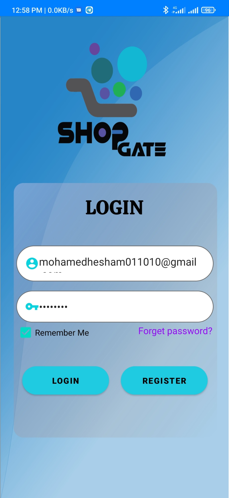
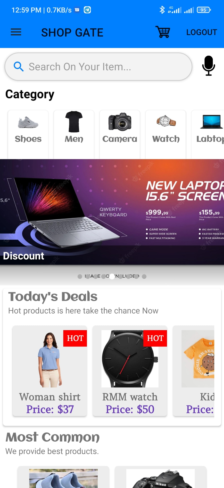

<h1> Android_E-Commerce_App-with-Firebase </h1>
 
<h2> Using Firestore and realtime Database </h2>
 
<h1> Splash Screen </h1>
 

 

<h1> Login page </h1>
 

 

<h1> Store Page </h1>
 
<h2> we have search by name and voice search </h2>

 

